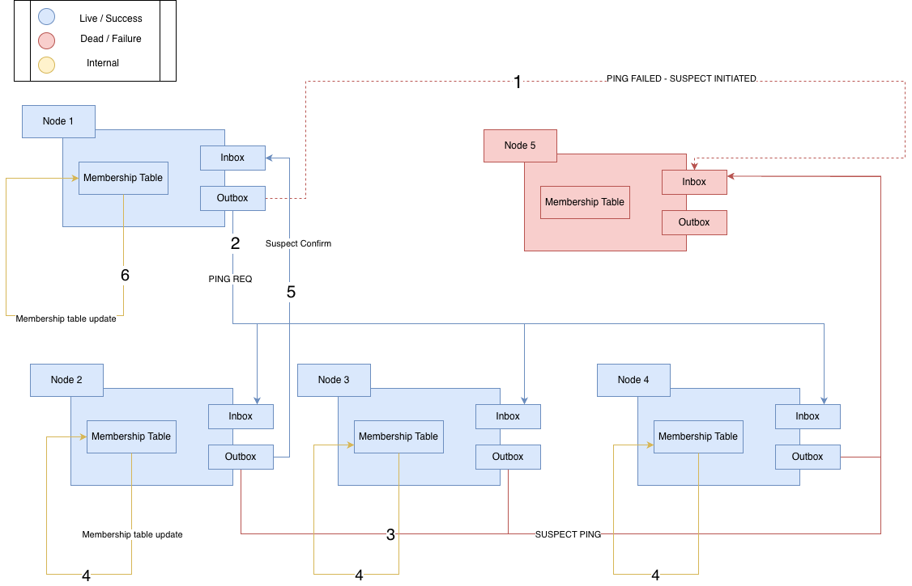
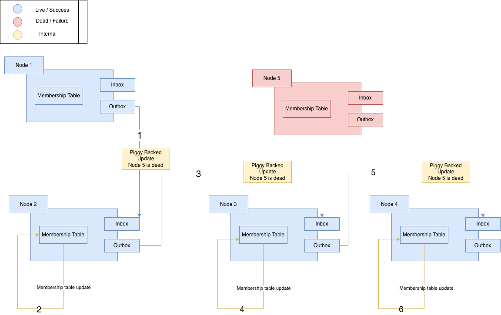

# ClusterPulse

ClusterPulse is an educational SWIM-style membership and failure-detection simulation written in Go.

It runs an in-memory cluster of nodes. Each node periodically probes peers, exchanges membership updates, suspects missing peers, asks helpers to perform indirect checks, and eventually marks unreachable nodes as failed.

> Status: Work in Progress


## Protocol Flow

### Direct Probe

1. A node chooses a random eligible peer.
2. It sends a `PING` with piggybacked membership updates.
3. The peer merges those updates and replies with an `ACK`.
4. The sender clears the pending ACK, marks the peer `alive`, and gossips that observation.

```text
node-1 -- PING + updates --> node-3
node-1 <-- ACK + updates ---- node-3
```

### Timeout, Suspicion, and Indirect Probe

1. If an ACK does not arrive before `-ack-timeout`, the observer marks the peer `suspect`.
2. The observer sends `PING-REQ` messages to up to three helper peers.
3. Each helper sends a `SUSPECT` message to the target.
4. If the target is reachable, it bumps its incarnation, marks itself `alive`, and sends `ALIVE` back through the helper.
5. If no alive confirmation clears the suspicion before the suspect timeout, the observer marks the target `failed`.

```text
node-1 -- PING ------------> node-4
node-1 -- timeout ---------> mark node-4 suspect
node-1 -- PING-REQ -------> node-2
node-2 -- SUSPECT --------> node-4
node-4 -- ALIVE ----------> node-2
node-2 -- ALIVE ----------> node-1
```



### Piggyback Gossip Flow

Membership changes are placed in each node's gossip queue and attached to outgoing protocol messages. Peers merge the received updates into their local membership table, then re-enqueue merged updates for limited retransmission.



### Membership Merge Rule

Every membership update contains:

- node ID
- status
- incarnation
- observation timestamp
- observer ID

Newer incarnations win. When two updates have the same incarnation, the higher-ranked status wins:

```text
alive < suspect < failed < left
```

## Project Structure

```text
.
├── main.go                  # CLI flags and scenario runner
├── cluster
│   └── cluster.go           # cluster lifecycle, in-memory router, failure injection
├── membership
│   ├── table.go             # per-node membership table and merge logic
│   └── table_test.go        # membership merge tests
├── node
│   └── node.go              # node runtime, probing, ACK/suspect timers, gossip
├── protocol
│   └── message.go           # message types, statuses, and update payloads
├── simlog
│   └── log.go               # leveled simulation logging
├── Logs                     # sample run logs
└── Misc
    ├── Piggybackflow.png    # piggyback gossip flow diagram
    ├── SuspectFlow.png      # suspect and indirect probe flow diagram
    └── to-do.md
```

## Getting Started

### Prerequisites

- Go 1.23 or newer

Check your local version:

```bash
go version
```

### Run the Simulation

From this directory:

```bash
go run .
```

Run a healthy cluster:

```bash
go run . -scenario healthy -duration 10s
```

Run a dead-node scenario:

```bash
go run . -scenario dead-node -target node-3 -duration 10s
```

Run the default flapping-node scenario with debug logs:

```bash
go run . -scenario flapping-node -target node-3 -duration 10s -debug
```

### CLI Flags

| Flag | Default | Description |
| --- | --- | --- |
| `-nodes` | `5` | Number of simulated nodes. |
| `-target` | `node-3` | Node used by failure/recovery scenarios. |
| `-scenario` | `flapping-node` | Scenario to run: `healthy`, `dead-node`, or `flapping-node`. |
| `-duration` | `10s` | Time to keep the simulation running after scenario actions. |
| `-probe-interval` | `750ms` | Interval between random peer probes per node. |
| `-ack-timeout` | `350ms` | Time to wait for an ACK before suspecting a peer. |
| `-debug` | `false` | Enable debug-level message, probe, router, and gossip logs. |

## Testing

Run the test suite:

```bash
go test ./...
```

The current tests focus on membership-table merge behavior and incarnation handling.

## Example Output

```text
[clusterpulse] 2026/06/26 12:00:00 [INFO] [cluster] started nodes=5
[clusterpulse] 2026/06/26 12:00:00 [INFO] [node] event=start node=node-1
[clusterpulse] 2026/06/26 12:00:03 [INFO] [scenario] fail node=node-3
[clusterpulse] 2026/06/26 12:00:04 [INFO] [failure] event=ack_timeout observer=node-1 subject=node-3 cid=node-1-...
[clusterpulse] 2026/06/26 12:00:05 [INFO] [failure] event=suspect_timeout observer=node-1 subject=node-3 action=mark_failed
```

## Current Capabilities

- In-memory cluster of configurable size
- Per-node goroutine event loops
- Randomized direct peer probing
- `PING` / `ACK` liveness checks
- ACK timeout tracking
- Suspect tracking and suspect timeout handling
- Indirect checks with `PING-REQ`, `SUSPECT`, and `ALIVE`
- Per-node membership tables
- Incarnation-based membership merge semantics
- Piggybacked gossip updates with retransmit limits
- Scenario-level node failure and recovery simulation
- Info/debug logs for protocol tracing

## Known Limitations

- The router only models failed endpoints today; configured latency, jitter, and drop-rate fields are not yet applied.
- `DEAD` and `CONFIRM` message types are defined but not fully implemented.
- The simulation uses in-memory channels rather than real network transport.
- Suspicion timeout is fixed at `3 * ack-timeout`.
- Final shutdown logs membership status for `node-3` specifically.
- Integration tests for full cluster behavior are still missing.

## Roadmap

- Apply router latency, jitter, and probabilistic packet drops
- Add deterministic integration tests for healthy, failed, and recovery scenarios
- Implement the final dead-node confirmation flow
- Add CLI flags for router failure-injection settings
- Make shutdown membership summaries configurable
- Improve observability around gossip queue state and retransmits

## Contributors

- Guhanesh T
- Ayush Kumar Rai

## License

None

## Note

ClusterPulse is primarily an educational and experimental project. It is not production-ready and should not be used as a real cluster membership service.
